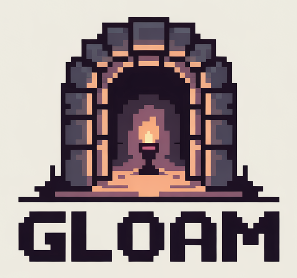

<div align="center">



# Gloam

**A modern .NET roguelike game engine with data-driven architecture**

[](https://dotnet.microsoft.com)
[](https://github.com/tgiachi/gloam)
[](LICENSE)
[](#testing)
[](https://tgiachi.github.io/gloam/)

_Craft immersive roguelike experiences with JSON-driven entities, flexible rendering backends, and smooth scene transitions_

</div>

---

## ✨ Features

🎮 **Modern Architecture**

- Data-driven entity system with JSON schema validation
- Flexible rendering pipeline supporting console and future backends
- Scene management with smooth transitions
- Real-time and turn-based game loop support

🎨 **Rich Console Rendering**

- Double-buffered console output for flicker-free rendering
- Layer-based rendering system with priority ordering
- ANSI color support with 60+ predefined colors
- Scene transitions (fade, push) with easing functions

⚡ **High Performance**

- DryIoc dependency injection for optimal performance
- Source generation for JSON serialization
- 70%+ test coverage with comprehensive validation
- Frame timing with high-precision timestamping

🛠 **Developer Experience**

- CLI tools for validation and development workflows
- DocFX documentation with custom theming
- Task runner integration for streamlined development
- Comprehensive logging and debugging support

## 🚀 Quick Start

### Prerequisites

- [.NET 9.0 SDK](https://dotnet.microsoft.com/download/dotnet/9.0)
- [Task](https://taskfile.dev) (recommended) or use dotnet commands

### Installation

```bash
# Clone the repository
git clone https://github.com/tgiachi/gloam.git
cd gloam

# Build the solution
task build
# Or using dotnet
dotnet build Gloam.slnx

# Run tests
task test
# Or using dotnet
dotnet test Gloam.slnx

# Run the demo
task demo
# Or using dotnet
dotnet run --project src/Gloam.Demo
```

### Your First Gloam Game

```csharp
using Gloam.Runtime;
using Gloam.Runtime.Config;
using Gloam.Console.Render.Rendering;

// Create and configure the game host
var hostConfig = new GloamHostConfig
{
    RootDirectory = Directory.GetCurrentDirectory(),
    EnableConsoleLogging = true
};

await using var host = new GloamHost(hostConfig);

// Setup console rendering
var renderer = new ConsoleRenderer();
host.SetRenderer(renderer);

// Initialize and run
await host.InitializeAsync();
await host.RunAsync(new GameLoopConfig
{
    KeepRunning = () => true,
    RenderStep = TimeSpan.FromMilliseconds(16) // 60 FPS
});
```

## 🎯 Demo

Experience Gloam's capabilities with our interactive demo:

- **Scene Management**: Smooth transitions between main menu and game
- **Player Movement**: WASD controls with collision detection
- **Visual Transitions**: Push and fade effects between scenes
- **Layer Rendering**: HUD, world, entities, and transition layers

```bash
# Run the demo
dotnet run --project src/Gloam.Demo

# Controls:
# Main Menu: 1-3 to select options
# Game: WASD to move, M to return to menu, ESC to exit
```

## 🏗 Architecture

Gloam follows a layered architecture with clear separation of concerns:

```
┌─────────────────┬─────────────────┬─────────────────┐
│   Gloam.Demo    │  Gloam.Cli      │   Your Game     │
├─────────────────┼─────────────────┼─────────────────┤
│         Gloam.Console.Render          │  Other Backends │
├───────────────────────────────────────┼─────────────────┤
│            Gloam.Runtime              │
├───────────────────────────────────────┤
│   Gloam.Core   │    Gloam.Data      │
└─────────────────┴─────────────────────┘
```

### Core Components

- **`Gloam.Core`**: Shared utilities, primitives, input abstractions, and rendering interfaces
- **`Gloam.Data`**: Entity management, JSON schema validation, and content loading
- **`Gloam.Runtime`**: Game host, scene management, DryIoc container, and game loop
- **`Gloam.Console.Render`**: Console-specific rendering implementation with layers
- **`Gloam.Demo`**: Example implementation showcasing engine capabilities

## 📊 Performance & Quality

- **70%+ Test Coverage**: Comprehensive test suite with 520+ passing tests
- **Zero Build Warnings**: Clean codebase following .NET best practices
- **Memory Efficient**: Double-buffered rendering with minimal allocations
- **High Performance**: DryIoc container optimized for game loop scenarios

## 🛠 Development

### Available Commands

```bash
# Task runner (recommended)
task                    # Show all available tasks
task dev                # Full development cycle
task build              # Build solution
task test               # Run all tests
task test-watch         # Run tests in watch mode
task coverage           # Generate coverage report
task docs-serve         # Serve documentation locally

# Alternative .NET commands
dotnet build Gloam.slnx
dotnet test Gloam.slnx
dotnet test --filter "TestName"
```

### Project Structure

```
gloam/
├── src/                    # Source code
│   ├── Gloam.Core/        # Core utilities and interfaces
│   ├── Gloam.Data/        # Entity and data management
│   ├── Gloam.Runtime/     # Game host and runtime services
│   ├── Gloam.Console.Render/ # Console rendering backend
│   └── Gloam.Demo/        # Demo application
├── tests/                  # Comprehensive test suite
├── tools/                  # CLI tools and utilities
├── docs/                   # DocFX documentation
└── images/                 # Assets and logos
```

## 🎨 Entity System

Gloam uses a data-driven approach with JSON-defined entities:

```json
{
  "id": "player",
  "name": "Player Character",
  "visual": {
    "glyph": "@",
    "foreground": "#FFD700",
    "background": null
  },
  "stats": {
    "health": 100,
    "mana": 50
  }
}
```

All entities are validated against auto-generated JSON schemas, ensuring data integrity and providing IntelliSense support in editors.

## 🔄 Scene System

Manage game states with the built-in scene system:

```csharp
// Create scenes
var mainMenu = new MainMenuScene();
var gameScene = new GameScene();

// Register with scene manager
sceneManager.RegisterScene(mainMenu);
sceneManager.RegisterScene(gameScene);

// Switch with transitions
var pushTransition = new PushTransition(
    TimeSpan.FromSeconds(1),
    PushDirection.FromLeft
);
await sceneManager.SwitchToSceneAsync("Game", pushTransition);
```

## 📖 Documentation

- **[📚 Full Documentation](https://tgiachi.github.io/gloam/)**: Complete guides, API reference, and examples
- **[🚀 Getting Started](https://tgiachi.github.io/gloam/getting-started.html)**: Quick start guide
- **[🏗️ Architecture](https://tgiachi.github.io/gloam/architecture/overview.html)**: Detailed architecture overview
- **[📝 API Reference](https://tgiachi.github.io/gloam/api/)**: Complete API documentation
- **[💡 Examples](https://tgiachi.github.io/gloam/examples/code-samples.html)**: Code samples and tutorials
- **[Changelog](CHANGELOG.md)**: Version history and updates

### Building Documentation Locally

```bash
# Install DocFX
dotnet tool install -g docfx

# Build and serve documentation
cd docs
docfx serve _site
# Open http://localhost:8080
```

Documentation is automatically updated and deployed to GitHub Pages on every version release.

## 🤝 Contributing

We welcome contributions! Please see our [Contributing Guide](CONTRIBUTING.md) for details.

### Development Setup

1. Fork the repository
2. Create a feature branch (`git checkout -b feature/amazing-feature`)
3. Make your changes with tests
4. Ensure 70%+ test coverage (`task coverage`)
5. Submit a pull request

## 📄 License

This project is licensed under the MIT License - see the [LICENSE](LICENSE) file for details.

## 🙏 Acknowledgments

- Built with modern .NET 9.0 and C# 13
- Powered by [DryIoc](https://github.com/dadhi/DryIoc) for dependency injection
- Documentation generated with [DocFX](https://dotnet.github.io/docfx/)
- Task automation via [Task](https://taskfile.dev)

---

<div align="center">

**[🏠 Home](https://github.com/tgiachi/gloam)** •
**[📖 Docs](https://yourdocs.github.io/gloam/)** •
**[🐛 Issues](https://github.com/tgiachi/gloam/issues)** •
**[💬 Discussions](https://github.com/tgiachi/gloam/discussions)**

Made with ❤️ for the roguelike community

</div>
